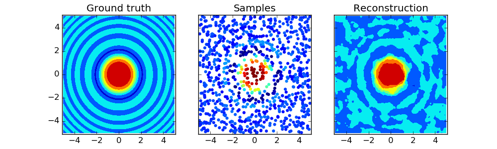

# Inverse distance weighting (IDW)

Inverse distance weighting is an interpolation method that computes
the score of query points based on the scores of their k-nearest
neighbours, weighted by the inverse of their distances.

As each query point is evaluated using the same number of data points,
this method allows for strong gradient changes in regions of high sample density
while imposing smoothness in data sparse regions.

## Example

``` python
import numpy as np
import matplotlib.pyplot as plt
from idw_interpolation import idw_tree

# create sample points with structured scores
X1 = 10 * np.random.rand(1000, 2) -5

def func(x, y):
    return np.sin(x**2 + y**2) / (x**2 + y**2)

z1 = func(X1[:,0], X1[:,1])

# 'train'
tree = idw_tree(X1, z1)

# 'test'
spacing = np.linspace(-5., 5., 100)
X2 = np.meshgrid(spacing, spacing)
grid_shape = X2[0].shape
X2 = np.reshape(X2, (2, -1)).T
z2 = tree(X2)

# plot
fig, (ax1, ax2, ax3) = plt.subplots(1,3, sharex=True, sharey=True, figsize=(10,3))
ax1.contourf(spacing, spacing, func(*np.meshgrid(spacing, spacing)))
ax1.set_title('Ground truth')
ax2.scatter(X1[:,0], X1[:,1], c=z1, linewidths=0)
ax2.set_title('Samples')
ax3.contourf(spacing, spacing, z2.reshape(grid_shape))
ax3.set_title('Reconstruction')
plt.show()
```


